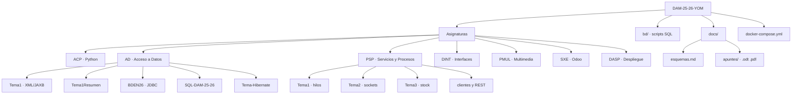
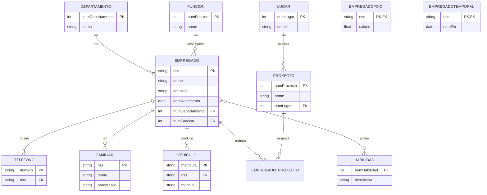
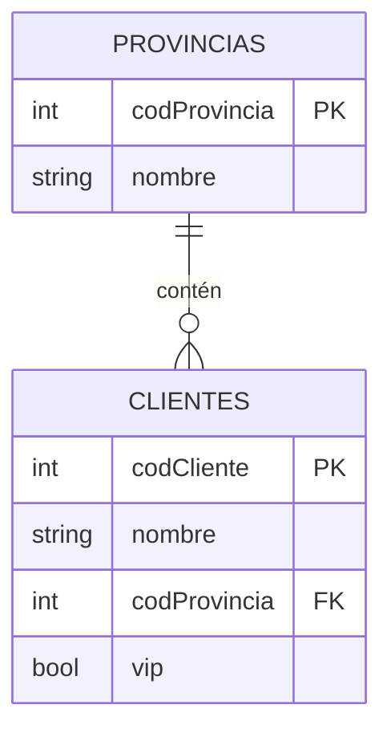

# Esquemas y diagramas

Diagramas del repositorio y de las bases de datos, en formato **Mermaid** (se renderizan automáticamente en GitHub).

---

## 1. Estructura del repositorio

---

## 2. Modelo entidad-relación · `BDEMPRESA25` (empresa)

Base de datos de una empresa (dominio en gallego), usada en **Acceso a Datos**. Modelo simplificado:

> **Nota**: `EMPREGADOFIXO` y `EMPREGADOTEMPORAL` son subtipos de `EMPREGADO` (herencia). El modelo exacto puede variar según la versión del script (`bd/empresa-*.sql`). Los POJOs de Hibernate (`Asignaturas/AD/Tema-Hibernate/`) reflejan las mismas entidades.

---

## 3. Modelo entidad-relación · `clientes`

Base de datos usada en **PSP** (API REST de clientes):

Datos de ejemplo incluidos en [`bd/clientes.sql`](../bd/clientes.sql): 2 clientes y 4 provincias (A Coruña, Lugo, Ourense, Pontevedra).
